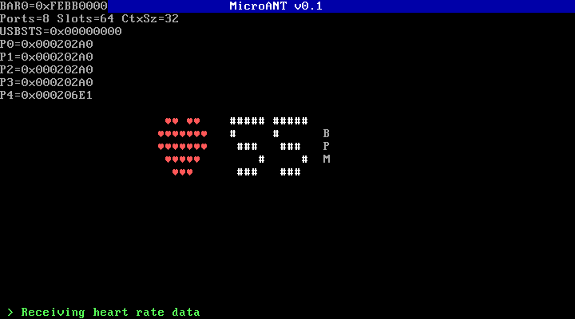

# MicroANT

A bare-metal x86 heart rate monitor that reads ANT+ wireless data from a Garmin USB stick and displays BPM in real time on a VGA text-mode screen.



## Overview

MicroANT is a single-purpose operating system. It boots directly into a heart rate display — no shell, no filesystem, no scheduler. The entire software stack, from PCI enumeration to ANT+ protocol parsing, runs in a single `kernel_main()` loop.

The system implements:

- **PCI bus scanning** to locate the xHCI (USB 3.0) controller
- **xHCI host controller driver** with command/transfer/event rings
- **USB device enumeration** with control and bulk transfers
- **ANT+ wireless protocol** for heart rate sensor communication
- **VGA text-mode display** with large digit rendering

## Built on the shoulders of

### ExigeOS

[ExigeOS](https://github.com/loicguillois/ExigeOS) is a hobby operating system written in C for x86 and Raspberry Pi 3. MicroANT reuses its boot infrastructure:

- `boot_x86.asm` — Multiboot-compliant entry point (32-bit protected mode, stack setup)
- `linker_x86.ld` — Linker script placing the kernel at 1 MB
- `io.h` — x86 port I/O primitives (`inb`, `outb`, `inl`, `outl`)
- `vga.c` / `vga.h` — VGA text mode driver (80x25, hardware cursor, scrolling)

The xHCI driver was written from scratch following the [xHCI USB driver guide](https://github.com/loicguillois/ExigeOS/blob/main/docs/XHCI_USB_DRIVER.md) created during ExigeOS development.

### tapinoma

[tapinoma](https://github.com/loicguillois/tapinoma) is a Node.js ANT+ heart rate reader for Garmin USB sticks. MicroANT's ANT+ implementation is a bare-metal C port of tapinoma's protocol logic:

- **Initialization sequence** — ported from `driver.js`: reset, network key, channel assignment, device profile configuration, channel open
- **Message format** — from `utils.js` and `messages.js`: `[SYNC=0xA4][LEN][MSG_ID][PAYLOAD][XOR_CHECKSUM]`
- **Heart rate parsing** — from `driver.js`: BPM extracted from broadcast data byte offset 7
- **ANT+ constants** — from `constants.js`: device type 120, period 8070, frequency 57, public network key

## Architecture

```
BIOS / QEMU
    |
    v
boot_x86.asm          Multiboot entry, sets up stack
    |
    v
kernel_main()          Main entry point (kernel.c)
    |
    +-- display_init()         VGA splash screen
    +-- pci_find_xhci()        Scan PCI bus for USB 3.0 controller
    +-- xhci_init()            Reset controller, set up rings, start
    +-- xhci_scan_ports()      Detect and address USB devices
    +-- usb_find_device()      Match Garmin VID/PID
    +-- ant_init()             Configure ANT+ heart rate channel
    +-- loop:
        +-- ant_poll_heart_rate()   Read bulk IN, parse ANT+ data
        +-- display_bpm()           Render large digits on screen
```

## Hardware requirements

- **ANT+ USB stick**: Garmin USB-m ANT Stick (VID `0x0FCF`, PID `0x1008`) or ANT USB Stick 3 (PID `0x1009`)
- **Heart rate sensor**: any ANT+ compatible chest strap or arm band

## Building

```bash
# Requirements: gcc (with 32-bit support), nasm, ld
# On Debian/Ubuntu: sudo apt install gcc libc6-dev-i386 nasm binutils

make
```

## Running

### With QEMU (no real device — stops at "No ANT+ stick found")

```bash
make run
```

### With a real Garmin ANT+ stick (USB passthrough)

```bash
# Requires root for USB passthrough
make run-passthrough
```

This passes the Garmin USB stick directly to the virtual machine:

```
qemu-system-i386 -kernel microant.bin \
    -device qemu-xhci,id=xhci \
    -device usb-host,vendorid=0x0fcf,productid=0x1008
```

To also enable a QEMU monitor for debugging (screendump, info usb, etc.):

```bash
sudo qemu-system-i386 -kernel microant.bin \
    -device qemu-xhci,id=xhci \
    -device usb-host,vendorid=0x0fcf,productid=0x1008 \
    -monitor tcp:127.0.0.1:55556,server,nowait
```

## Project structure

```
MicroANT/
├── Makefile              Build system (x86 only)
├── README.md
├── screenshot.png
└── src/
    ├── boot_x86.asm      Multiboot entry point (from ExigeOS)
    ├── linker_x86.ld     Linker script (from ExigeOS)
    ├── io.h              x86 port I/O (from ExigeOS)
    ├── vga.h / vga.c     VGA text mode driver (from ExigeOS)
    ├── string.h / .c     memset, memcpy, memcmp
    ├── alloc.h / .c      Bump allocator (1 MB heap)
    ├── pci.h / .c        PCI bus enumeration
    ├── xhci.h / .c       xHCI USB host controller driver
    ├── usb.h / .c        USB enumeration and transfers
    ├── ant.h / .c        ANT+ protocol (ported from tapinoma)
    ├── display.h / .c    BPM display with large digits
    └── kernel.c          Main entry point and boot sequence
```

## Author

**Loïc Guillois** — [github.com/loicguillois](https://github.com/loicguillois)

## License

MIT
